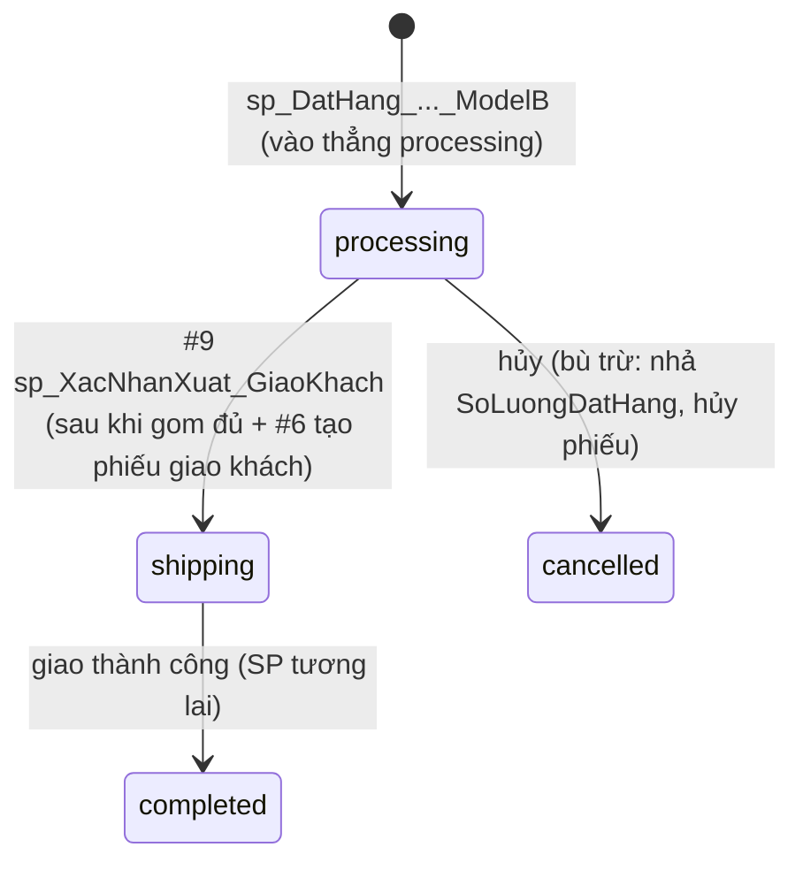

# THIẾT KẾ — Chức năng "Người dùng tạo đơn hàng" (Site khu vực)

> **Phạm vi:** Đề xuất phương án xử lý nghiệp vụ **tạo đơn hàng** chạy ở **Site Bắc/Nam**, dựa trên bộ stored procedure đã có trong `sitemain/src/main/resources/static/db/proceduce/` (DB `store_management`).
> **Không** code ở doc này — đây là bản thiết kế để chốt luồng, hợp đồng API, ranh giới giao dịch và các khoảng trống cần bổ sung.
> **Liên quan:** [PHASE2_DOMAIN_ENTITY](PHASE2_DOMAIN_ENTITY.md) (bảng Nhóm B), [PHASE10_NEXT_PHASE](PHASE10_NEXT_PHASE.md) (vai trò site), [FRONTEND_PHASE12_ORDERS](FRONTEND_PHASE12_ORDERS.md) (hợp đồng FE dự kiến).

---

## 1. Bối cảnh & nguyên tắc

- **Đơn hàng KHÔNG thuộc Site Main.** Site Main chỉ **xác thực + dữ liệu dùng chung + định tuyến**. Toàn bộ `DonHang/ChiTietDonHang/TonKho/Kho/PhieuXuatKho/PhieuNhapKho` nằm ở **site khu vực** (Bắc `:8081`, Nam `:8082`), phân mảnh theo `DonHang.MaKhuVucXuLi`.
- **Khu vực xử lý = khu vực của user.** Lấy từ `maKhuVuc` trong JWT (`"Bac"`/`"Nam"`). Site Main forward `POST /api/orders` tới site tương ứng; site đó đặt `MaKhuVucXuLi` = khu vực của mình.
- **Quan sát quan trọng về "phân tán":** Trong **một khu vực**, mọi kho nằm **chung một DB `store_management`** của site đó. Vì vậy đơn **được phục vụ đủ trong vùng = một giao dịch ACID đơn-DB** (KHÔNG cần 2PC). Phân tán thật chỉ xuất hiện khi **thiếu hàng phải lấy từ vùng khác** → mục [§11](#11-liên-vùng--đã-hiện-thực-qua-linked-server-cần-lưu-ý-hạ-tầng).
- **Mô hình "đặt chỗ" (reservation), không trừ tồn ngay:** giữ hàng = tăng `TonKho.SoLuongDatHang`; `SoLuongTon` chỉ giảm khi **xác nhận xuất kho** thực tế. Khả dụng = `SoLuongTon - SoLuongDatHang`.

---

## 2. Tài nguyên DB liên quan

### 2.1 Bảng (Nhóm B — site khu vực)
| Bảng | Vai trò trong tạo đơn |
|---|---|
| `DonHang` / `ChiTietDonHang` | Đầu đơn + dòng đơn. `TrangThaiDH ∈ {pending, processing, shipping, completed, cancelled}`; `ThanhTien` là cột PERSISTED (chỉ đọc). |
| `Kho` | Điểm kho trong vùng (`MaKhuVuc`, `TrangThai=1` = hoạt động). |
| `TonKho` | `SoLuongTon`, `SoLuongDatHang`, `RowVer ROWVERSION`, UNIQUE(`MaKho`,`MaSP`), CHECK `SoLuongTon ≥ SoLuongDatHang`. |
| `PhieuXuatKho` / `ChiTietXuatKho` | Phiếu xuất. `MaKhoNhan NULL` = **xuất giao khách**; khác NULL = **luân chuyển nội bộ** (`TrangThaiNhan='waiting_receive'`). `MaDonHang`,`MaKhoNhan`,`MaCTDH` là **khóa logic (không FK)**. |
| `PhieuNhapKho` / `ChiTietPhieuNhap` | Phiếu nhập nội bộ tại kho gom (`TrangThaiNhap='waiting_import'` → `'imported'`). |

### 2.2 Table type (TVP) các SP yêu cầu
- `dbo.OrderItemType` ≈ `(MaSP VARCHAR(20), SoLuong INT)` — danh sách hàng đặt.
- `dbo.PhanBoXuatType` ≈ `(MaCTDH UNIQUEIDENTIFIER, MaSP VARCHAR(20), MaKhoXuat VARCHAR(20), MaKhoNhan VARCHAR(20) NULL, SoLuongXuat INT)` — bảng **phân bổ xuất kho**.

---

## 3. Catalog stored procedure (đã có)

| # | SP | Tham số chính | Vai trò | Idempotent | Giao dịch |
|---|---|---|---|---|---|
| **0** | **`sp_DatHang_TuSiteBac_ModelB`** | `@MaND,@HoTen…,@MaKhuVucXuLi,@MaKhoNhan,@MaKhoUuTien=NULL,@Items OrderItemType,@MaDonHang OUT` | **SP điều phối (entry)** — toàn bộ Pha A: giữ hàng **local → remote**, tạo `DonHang`(`processing`)+`ChiTietDonHang`, dựng `@PhanBo`, gọi #3+#5 cho luân chuyển nội vùng **và liên vùng qua `[LINK]`** (#4). | không | **mở 1 tran; nhánh liên vùng → MS DTC** |
| 1 | `sp_ChonKhoNhan_ToiUu` | `@MaKhuVucXuLi`, `@Items OrderItemType`, `@MaKhoNhan OUT` | Chọn **kho gom/xử lý** tối ưu trong vùng (kho phủ được nhiều đơn nhất). Trả thêm bảng xếp hạng ứng viên. **Là bước chạy TRƯỚC #0** để có `@MaKhoNhan`. | có (read-only) | không mở tran |
| 2 | `sp_GiuHang_1SanPham_NoiBo` | `@MaSP`, `@SoLuongCan`, `@MaKhuVucSite`, `@MaKhoUuTien=NULL` | **Giữ hàng 1 SP** trải trên các kho trong vùng (ưu tiên `@MaKhoUuTien`), tăng `SoLuongDatHang` dưới `UPDLOCK/HOLDLOCK`. Trả rows `(MaKho, MaSP, SoLuongGiu)`. Lỗi nếu vùng không đủ. | **không** (gọi lại giữ thêm) | tự mở nếu `@@TRANCOUNT=0` |
| 3 | `sp_TaoPhieuXuat_Batch_NoiBo` | `@MaDonHang`, `@PhanBo PhanBoXuatType`, `@TrangThaiBanDau='waiting_export'` | Tạo `PhieuXuatKho` theo từng cặp `(KhoXuat,KhoNhan)`. Chuẩn hóa `KhoXuat=KhoNhan → KhoNhan NULL` (thành dòng **giao khách**). Tạo `ChiTietXuatKho`. | **có** (`NOT EXISTS`) | tự mở nếu `@@TRANCOUNT=0` |
| 4 | `sp_TaoPhieuXuat_Batch_NoiBo_Json` | `@MaDonHang`, `@PhanBoJson`, `@TrangThaiBanDau` | Bọc JSON của #3 (để **gọi từ xa/liên site**). Parse JSON → `PhanBoXuatType` → gọi #3. | như #3 | ủy thác #3 |
| 5 | `sp_TaoPhieuNhap_NoiBo_Batch` | `@MaDonHang`, `@PhanBo PhanBoXuatType` | Tạo `PhieuNhapKho` (`waiting_import`) tại kho gom cho các dòng **luân chuyển** (`KhoXuat<>KhoNhan`). `DonGiaNhap` lấy tạm `SanPham_Core.GiaBan`. | **có** (`NOT EXISTS`) | tự mở nếu `@@TRANCOUNT=0` |
| 6 | `sp_TaoPhieuXuat_GiaoKhach_KhiDuHang` | `@MaDonHang`, `@MaKhoXuat`, `@MaPhieuXuat OUT` | Phiếu **xuất giao khách cuối**. Chỉ chạy khi đơn `processing`, **không còn phiếu nhập treo**, kho gom **đủ hàng đã giữ**. Tái dùng phiếu `KhoNhan NULL` sẵn có rồi thêm dòng còn thiếu. | **có** (`NOT EXISTS` theo `MaCTDH`) | tự mở tran riêng |
| **7** | **`sp_XacNhanXuat_NoiBo`** | `@MaPhieuXuat` | **Pha B — xác nhận xuất luân chuyển** (`MaKhoNhan` khác NULL). Khóa phiếu `UPDLOCK/HOLDLOCK`, kiểm `waiting_export`, **giảm `SoLuongTon` VÀ `SoLuongDatHang` kho nguồn**, set `exported`. | không (chặn double qua trạng thái) | tran riêng đứng độc lập |
| **8** | **`sp_XacNhanNhap_NoiBo`** | `@MaPhieuNhap`, `@MaNhanVienNhap` | **Pha B — xác nhận nhập tại kho gom**. Kiểm NV hợp lệ + phiếu xuất nguồn đã `exported` (local **hoặc qua `[LINK]`** nếu kho nguồn ở vùng khác); **cộng `SoLuongTon` VÀ `SoLuongDatHang` kho gom** (INSERT nếu chưa có dòng); set `imported`; đồng bộ `TrangThaiNhan='received'` ở phiếu xuất nguồn. | không (chặn qua trạng thái) | tran riêng; **nguồn remote ⇒ MSDTC** |
| **9** | **`sp_XacNhanXuat_GiaoKhach`** | `@MaPhieuXuat` | **Pha B — xác nhận xuất giao khách** (`MaKhoNhan IS NULL`). Kiểm `waiting_export`, **giảm `SoLuongTon` VÀ `SoLuongDatHang` kho gom**, set `exported`, chuyển `DonHang` `processing → shipping`. | không (chặn qua trạng thái) | tran riêng đứng độc lập |

> **Mẫu giao dịch chung:** SP **Pha A** (#0–#6) dùng `SET XACT_ABORT ON` + `TRY/CATCH` + cờ `@StartedTran = (@@TRANCOUNT=0)`. Nghĩa là **khi gọi trong một transaction bao ngoài, chúng tự enlist** (không tự commit/rollback) → **ghép được thành 1 giao dịch lớn**. SP #0 lợi dụng đúng điều này: nó mở `BEGIN TRANSACTION` rồi gọi #2/#3/#5 ⇒ tất cả enlist chung, all-or-nothing.
>
> SP **Pha B** (#7–#9, xác nhận xuất/nhập) thì **mỗi cái mở 1 `BEGIN TRANSACTION` độc lập** — vì chúng do **nhân viên kho** kích hoạt rời rạc (quét phiếu), không ghép chung. Tính an toàn dựa vào `UPDLOCK/HOLDLOCK` trên dòng phiếu + **chốt chuyển trạng thái** (`waiting_export/​waiting_import` → …) để chống xác nhận trùng.

### 3.1 ✅ Cấu hình biến vùng theo từng site (đã sửa)

Trước đây hai biến vùng bị **gán ngược** (`Local='Nam'`) so với tên SP — đã sửa trong `taodon.sql`:

```sql
DECLARE @MaKhuVucLocal  VARCHAR(10) = 'Bac',   -- bản site Bắc
        @MaKhuVucRemote VARCHAR(10) = 'Nam';
```

**Quy ước triển khai (đã chốt — [§12](#12-quyết-định-đã-chốt) mục 1 & 4):** dùng **cùng một tên SP** `sp_DatHang_TuSiteBac_ModelB` trên **cả 2 DB**, mỗi bản đặt biến vùng của site mình:

| DB cài đặt | `@MaKhuVucLocal` | `@MaKhuVucRemote` |
|---|---|---|
| Site **Bắc** (`taodon.sql` trong repo) | `'Bac'` | `'Nam'` |
| Site **Nam** | `'Nam'` | `'Bac'` |

> Nếu sai (như bản cũ trên DB Bắc với `Local='Nam'`): bước kiểm kho gom `@MaKhoNhan=KB01` lọc `MaKhuVuc='Nam'` ⇒ không khớp ⇒ `RAISERROR` ngay; phần "giữ local" cũng luôn rỗng ⇒ ép mọi thứ sang remote. Vì vậy **mỗi site phải tự đặt đúng**.

---

## 4. Trạng thái khoảng trống

1. ✅ **ĐÃ GIẢI QUYẾT — SP tạo đầu đơn.** `sp_DatHang_TuSiteBac_ModelB` (file `taodon.sql`) chính là master SP: tạo `DonHang`+`ChiTietDonHang` (lấy `MaCTDH` qua `OUTPUT … INTO #CTDHMap`), dựng `@PhanBo` và gọi #3/#5. *(Biến vùng đã sửa đúng theo từng site — §3.1.)*
2. ✅ **ĐÃ GIẢI QUYẾT — SP xác nhận xuất/nhập thực sự trừ/cộng `TonKho`.** Đã có **3 SP Pha B**: `sp_XacNhanXuat_NoiBo` (xuất luân chuyển → trừ kho nguồn), `sp_XacNhanNhap_NoiBo` (nhập kho gom → cộng kho gom, kiểm phiếu nguồn `exported` local/`[LINK]`), `sp_XacNhanXuat_GiaoKhach` (giao khách → trừ kho gom + `processing→shipping`). **Chống ghi đè bằng `UPDLOCK/HOLDLOCK` + chốt trạng thái phiếu** (không dùng `RowVer` — xem [§9](#9-giao-dịch--đồng-thời)). 3 SP này **không** tham chiếu biến vùng nên dùng chung được cho cả 2 site.
3. ⏳ **CÒN THIẾU — `sp_HuyDon`** (bù trừ — [§10](#10-hủy-đơn--bù-trừ-compensation)) và **SP đóng đơn `shipping→completed`**. *(Không cần SP tên riêng cho Nam: dùng chung tên SP, đặt biến vùng theo site — [§12](#12-quyết-định-đã-chốt) mục 1 & 4.)*
4. ✅ **Hạ tầng `[LINK]` + MS DTC — đã chốt dùng (2PC).** SP #0 (và #8 ở Pha B) gọi `[LINK].[store_management].dbo.…` *trong* transaction ⇒ giao dịch phân tán MSDTC. **Đã cấu hình MSDTC + linked server và test SSMS ổn định** ([§12](#12-quyết-định-đã-chốt) mục 2). Xem [§11](#11-liên-vùng--đã-hiện-thực-qua-linked-server-cần-lưu-ý-hạ-tầng).

---

## 5. Luồng tạo đơn end-to-end

Chia làm **2 pha**: **(A) Đồng bộ** — trả kết quả ngay cho user (1 giao dịch ACID); **(B) Bất đồng bộ** — nhân viên kho luân chuyển & giao hàng (eventually consistent qua trạng thái phiếu).

### 5.1 Sequence

```mermaid
sequenceDiagram
  participant FE as Frontend
  participant Main as Site Main (:8080)
  participant Reg as Site Khu vực (:8081/:8082)
  participant DB as store_management (SP)

  participant Link as [LINK] site remote
  FE->>Main: POST /api/orders (JWT)
  Main->>Reg: Forward theo maKhuVuc (đặt MaKhuVucXuLi)
  Reg->>DB: đọc giỏ ChiTietGioHang → dựng @Items (TVP)
  Reg->>DB: sp_ChonKhoNhan_ToiUu → @MaKhoNhan (kho gom)
  Note over Reg,Link: ====== PHA A — sp_DatHang_TuSiteBac_ModelB (1 TRAN; remote ⇒ MSDTC) ======
  Reg->>DB: EXEC sp_DatHang_..._ModelB(@MaKhoNhan, @Items, …)
  DB->>DB: giữ local (sp_GiuHang) + tạo DonHang(processing)+ChiTietDonHang
  DB->>Link: giữ remote + sp_TaoPhieuXuat_Batch_NoiBo_Json (qua [LINK])
  DB->>DB: phiếu nội vùng (#3+#5) + phiếu nhập chờ cho phần remote (#5)
  DB-->>Reg: COMMIT → @MaDonHang, @TongTien
  Reg->>DB: UPDATE GioHang SET TrangThai='ordered'
  Reg-->>FE: 201 Order { processing, items, tongTien }
  Note over Reg,Link: ====== PHA B — BẤT ĐỒNG BỘ (NV kho) ======
  DB->>DB: sp_XacNhanXuat_NoiBo (waiting_export→exported, TonKho nguồn −/−)
  DB->>DB: sp_XacNhanNhap_NoiBo (waiting_import→imported, TonKho gom +/+; kiểm nguồn exported)
  DB->>DB: khi hết phiếu nhập treo → sp_TaoPhieuXuat_GiaoKhach_KhiDuHang (tạo phiếu giao khách)
  DB->>DB: sp_XacNhanXuat_GiaoKhach (TonKho gom −/−) → DonHang processing→shipping
```
> Toàn bộ bước Pha B đã có SP (#7–#9). Mỗi bước là **một giao dịch độc lập** do nhân viên kho kích hoạt; với phiếu nguồn ở vùng khác, `sp_XacNhanNhap_NoiBo` đọc/ghi qua `[LINK]` ⇒ thêm một điểm **MSDTC** ở Pha B ([§11](#11-liên-vùng--đã-hiện-thực-qua-linked-server-cần-lưu-ý-hạ-tầng)).

### 5.2 Vì sao 2 SP xuất (#3 và #6) không đụng nhau
- Trong master #0, #3 **chỉ nhận dòng luân chuyển** `MaKhoXuat<>@MaKhoNhan` (vd `KB02→KB01`) ⇒ #3 tạo **phiếu luân chuyển** (`waiting_export` + `waiting_receive`), **không** sinh phiếu giao khách. Phần hàng **đã sẵn ở kho gom** (`MaKho=@MaKhoNhan`) bị master bỏ qua, **không sinh phiếu** lúc đặt.
- `sp_TaoPhieuXuat_GiaoKhach_KhiDuHang` (#6, Pha B) là nơi **duy nhất** tạo **phiếu giao khách** (`MaKhoNhan IS NULL`, gộp đủ mọi `MaCTDH`), chạy khi hàng đã gom đủ. (Logic "tái dùng phiếu `KhoNhan NULL` + `NOT EXISTS theo MaCTDH`" của #6 chỉ để **idempotent** khi gọi lại.)
- ⇒ Hai SP thao tác trên **tập phiếu rời nhau** (phiếu luân chuyển vs. phiếu giao khách) nên không nhân đôi dòng. Phiếu giao khách này về sau do **#9 `sp_XacNhanXuat_GiaoKhach`** xác nhận.

### 5.3 State machine `DonHang`


> SP #0 **không dùng** trạng thái `pending` — đơn được tạo trực tiếp ở `processing`. Lỗi trong Pha A ⇒ rollback, đơn không phát sinh. Mốc `shipping→completed` **chưa có SP** (còn thiếu — [§4](#4-trạng-thái-khoảng-trống)).

### 5.4 Vòng đời `TonKho` của một dòng hàng phải luân chuyển (vd `KN01 → KB01 → khách`)

| Mốc | SP | `SoLuongTon` | `SoLuongDatHang` | Khả dụng |
|---|---|---|---|---|
| Đặt hàng (giữ) | #0 → #2 tại **KN01** | — | **+q** (KN01) | −q |
| Xác nhận xuất nguồn | #7 tại **KN01** | **−q** (KN01) | **−q** (KN01) | 0 (rời kho nguồn) |
| Xác nhận nhập kho gom | #8 tại **KB01** | **+q** (KB01) | **+q** (KB01) | hàng về, **vẫn giữ** cho đơn |
| Xuất giao khách | #9 tại **KB01** | **−q** (KB01) | **−q** (KB01) | hàng rời hệ thống |

> Đọc dọc: "chỗ giữ" (`SoLuongDatHang`) **di chuyển** từ kho nguồn sang kho gom cùng với hàng, nên đến bước giao khách kho gom luôn có đủ `SoLuongDatHang` = tổng đơn (gồm cả phần vốn đã sẵn ở KB01 được giữ từ đầu). Phần hàng **vốn ở KB01** chỉ trải qua 2 mốc: giữ (đặt hàng) → trừ (giao khách), không qua #7/#8.

---

## 6. Dàn xếp (orchestration) — đã hiện thực ở SP #0

Toàn bộ Pha A nằm gọn trong **`sp_DatHang_TuSiteBac_ModelB`** (1 `BEGIN TRANSACTION`). Các bước thực tế:

| Bước trong SP | Làm gì | SP/Logic dùng |
|---|---|---|
| 0. Validate | COD-only; `@Items` không rỗng/SL>0; kho gom `@MaKhoNhan` thuộc vùng local & `TrangThai=1`; mọi `MaSP` tồn tại & `SanPham_Core.TrangThai=1` | inline |
| 1. Gom nhu cầu | `#NhuCau(MaSP, SoLuongCan, DonGia=GiaBan)` gộp theo SP | inline |
| 2. Giữ hàng **local-first** | Với mỗi SP: tính khả dụng vùng local (`UPDLOCK,HOLDLOCK`), lấy `min(local, cần)` rồi giữ; **phần thiếu** giữ ở vùng remote qua `[LINK]` | #2 (local) + `[LINK]…`#2 (remote) → `#PhanBo(MaKho,MaSP,SoLuongGiu,IsRemote)` |
| 3. Kiểm đủ | Nếu `Σ giữ < nhu cầu` ⇒ `RAISERROR('… vẫn không đủ hàng')` (rollback) | inline |
| 4. Tạo đơn | `INSERT DonHang` (`TrangThaiDH='processing'`, `TrangThaiTT='waiting_cod'`); `TongTien=Σ(SL×DonGia)` | inline |
| 5. Chi tiết đơn | `INSERT ChiTietDonHang … OUTPUT inserted.MaCTDH,MaSP INTO #CTDHMap` | inline |
| 6. Phiếu **nội vùng** | Dòng `IsRemote=0 AND MaKho<>@MaKhoNhan` (vd `KB02→KB01`) → phiếu xuất + phiếu nhập chờ | #3 + #5 (local) |
| 7. Phiếu **liên vùng** | Dòng `IsRemote=1` (vd `KN01→KB01`): build JSON `FOR JSON PATH` → tạo phiếu xuất **ở site remote** qua `[LINK]`; tạo phiếu nhập chờ tại kho gom (local) | `[LINK]…`#4 + #5 (local) |

**Điểm tinh tế đã đúng theo thiết kế:**
- Phần hàng **đã nằm sẵn ở kho gom** (`IsRemote=0, MaKho=@MaKhoNhan`) **không sinh phiếu** — sẽ được phiếu **giao khách cuối** (#6, Pha B) gộp vào.
- `MaCTDH` lấy qua `OUTPUT … INTO #CTDHMap` rồi `JOIN ON MaSP` để dựng `@PhanBo*` — đúng như cần.
- Đơn vào thẳng **`processing`** (không qua `pending`) vì hàng có thể đang trên đường gom về kho xử lý.

**Đầu vào quan trọng (caller phải chuẩn bị TRƯỚC khi gọi #0):**
- `@MaKhoNhan` — **không** được #0 tự chọn. Caller gọi `sp_ChonKhoNhan_ToiUu` trước để lấy kho gom tối ưu, rồi truyền vào.
- `@Items` — TVP `OrderItemType`, dựng từ giỏ server.

> **Vai trò Java = điều phối mỏng:** validate đầu vào → đọc giỏ → `sp_ChonKhoNhan_ToiUu` → gọi `sp_DatHang_TuSiteBac/Nam_ModelB` → map `Order` response → ánh xạ `RAISERROR`→`ErrorResponse`. **Không** mở thêm transaction ở Java (SP đã tự quản 1 tran; nhánh liên vùng do MSDTC lo).

---

## 7. Hợp đồng API (site khu vực)

**`POST /api/orders`** — *cần auth (Bearer)*. Tạo đơn từ **giỏ hàng phía server** của user.

Request:
```jsonc
{
  "hoTenNguoiNhan": "Nguyễn Văn A",
  "soDienThoaiNhan": "0901234567",
  "diaChiGiao": "12 Lê Lợi, Q1",
  "phuongThucTT": "COD",      // hiện chỉ COD
  "ghiChu": "Giao giờ hành chính"
}
```
- **Items lấy từ `ChiTietGioHang`** của user tại site (không nhận items từ client để tránh giả mạo giá/SL). `MaND`, `MaKhuVucXuLi` suy từ JWT.

Response `201` (`ApiResponse<Order>`):
```jsonc
{
  "success": true, "message": "Đặt hàng thành công",
  "data": {
    "maDonHang": "…", "trangThaiDH": "processing", "trangThaiTT": "waiting_cod",
    "tongTien": 1290000, "ngayDat": "…", "khuVucXuLi": "Bac",
    "items": [{ "maSP": "SP001", "tenSP": "…", "soLuong": 2, "donGia": 645000, "thanhTien": 1290000 }]
  }
}
```

Lỗi (qua `GlobalExceptionHandler` → `ErrorResponse`): giỏ rỗng → `CART_EMPTY`; vùng không đủ hàng (SP RAISERROR) → `OUT_OF_STOCK`; SP không tồn tại/giá đổi → `PRODUCT_INVALID`.

**Định tuyến (đã chốt — [§12](#12-quyết-định-đã-chốt) mục 7): FE gọi thẳng site khu vực.** FE chọn `getRegionalApiClient` theo `maKhuVuc` của user (giống hệt các API giỏ hàng) → gọi trực tiếp `:8081`/`:8082`. **Không** dựng proxy ở Site Main. Endpoint xác thực bằng Bearer như cart ([FRONTEND_PHASE12](FRONTEND_PHASE12_ORDERS.md)).

---

## 8. Tích hợp Java

SP #0 nhận **`@Items` là TVP `OrderItemType`** (không phải JSON) → Java **phải truyền được TVP**:
- **TVP từ Java:** `mssql-jdbc` `SQLServerDataTable` (addColumnMetadata `MaSP`/`SoLuong`, addRow theo từng dòng giỏ) + `SQLServerCallableStatement.setStructured("Items","dbo.OrderItemType", dataTable)`. Với Spring: `SimpleJdbcCall` + `SqlParameter("Items", microsoft.sql.Types.STRUCTURED)` truyền `SQLServerDataTable`, hoặc `JdbcTemplate.execute(CallableStatementCreator…)` rồi unwrap `SQLServerCallableStatement`.
- **OUTPUT param** `@MaDonHang`: `SqlOutParameter`. Result set cuối của SP trả `(MaDonHang, TongTien, ThongBao)` — đọc để dựng response.
- **Trước khi gọi #0:** gọi `sp_ChonKhoNhan_ToiUu` (cũng TVP `@Items`) lấy `@MaKhoNhan`. Hai lần dựng TVP từ cùng danh sách giỏ.
- **MSDTC:** nhánh liên vùng chạy DTC. Driver mssql-jdbc hỗ trợ; **không** bọc thêm JTA ở Java — để SP + SQL Server tự lo. Java chỉ cần 1 lời gọi `EXEC`.
- **Map lỗi:** `RAISERROR(…,16,…)` → `SQLServerException` → bắt ở service, ánh xạ sang `ErrorCodes` (`OUT_OF_STOCK`, `PRODUCT_INVALID`, `CART_EMPTY`…) thay vì lộ message thô.

> Nếu muốn **né TVP** ở Java: thêm 1 lớp bọc `*_Json` cho #0 (nhận `@ItemsJson`, `OPENJSON` → TVP rồi gọi #0) — tương tự cách `sp_TaoPhieuXuat_Batch_NoiBo_Json` bọc #3. Cân nhắc nếu ngại marshalling TVP — **đã chốt truyền TVP trực tiếp** ([§12](#12-quyết-định-đã-chốt) mục 6).

---

## 9. Giao dịch & đồng thời

| Vấn đề | Cơ chế (đã có / cần thêm) |
|---|---|
| Đặt chỗ tránh oversell | `sp_GiuHang` đọc `UPDLOCK,HOLDLOCK` trên `TonKho`, `UPDATE … WHERE (SoLuongTon-SoLuongDatHang) >= @Lay` rồi kiểm `@@ROWCOUNT=1`. |
| All-or-nothing Pha A | SP #0 mở 1 `BEGIN TRANSACTION` bọc tất cả (kể cả call `[LINK]`). Rollback **tự nhả** `SoLuongDatHang` (cả local lẫn remote). |
| Đơn phục vụ **đủ trong vùng** | Mọi kho cùng vùng ở chung DB ⇒ **single-DB ACID, không 2PC**. |
| Đơn **lấy hàng liên vùng** | SP #0 gọi `[LINK]` *trong* transaction ⇒ **MS DTC / 2PC ngầm**. Cần MSDTC + linked server. |
| Chống xác nhận xuất/nhập trùng | SP #7–#9 khóa **dòng phiếu** `UPDLOCK,HOLDLOCK` + **chốt chuyển trạng thái** (`waiting_export/​waiting_import` → …): lần xác nhận thứ 2 thấy trạng thái đã đổi ⇒ `RAISERROR`. (Chọn **khóa bi quan thay cho `RowVer`** — `TonKho.RowVer` hiện chưa được dùng.) |
| Double-submit (đặt 2 lần) | Đặt `GioHang.TrangThai='ordered'` trong cùng transaction; (tùy chọn) Idempotency-Key. |

**Pha B — 3 SP xác nhận đã có (#7–#9):**
- `sp_XacNhanXuat_NoiBo(@MaPhieuXuat)`: `waiting_export→exported`; **giảm** `SoLuongTon` **và** `SoLuongDatHang` kho nguồn.
- `sp_XacNhanNhap_NoiBo(@MaPhieuNhap,@MaNhanVienNhap)`: `waiting_import→imported`; **cộng** `SoLuongTon` **và** `SoLuongDatHang` kho gom (giữ chỗ để #6/#9 thấy "đủ hàng đã giữ"); kiểm phiếu nguồn `exported` (local/`[LINK]`).
- `sp_XacNhanXuat_GiaoKhach(@MaPhieuXuat)`: `waiting_export→exported`; **giảm** cả hai ở kho gom; `processing→shipping`.

> **Lưu ý review:** bước kiểm đủ tồn trong #7–#9 đọc `TonKho` **không** `UPDLOCK` (chỉ khóa dòng *phiếu*), nên về lý thuyết có khe TOCTOU giữa "kiểm" và "trừ". Trên thực tế `XACT_ABORT` + `CHECK (SoLuongTon ≥ SoLuongDatHang)` chặn âm tồn (giao dịch fail-rollback thay vì sai số). **Đã chốt** ([§12](#12-quyết-định-đã-chốt) mục 3) bổ sung `WITH (UPDLOCK,HOLDLOCK)` vào truy vấn kiểm tồn để bịt hẳn khe TOCTOU.

---

## 10. Hủy đơn & bù trừ (compensation)

- **Lỗi trong Pha A:** transaction rollback → không phát sinh gì, hàng giữ được nhả tự động.
- **Hủy sau khi `processing`:** không thể rollback DB nữa → chạy **bù trừ**: hủy `PhieuXuatKho/PhieuNhapKho` chưa thực hiện (`→cancelled`), **nhả** `SoLuongDatHang` phần chưa xuất, set `DonHang='cancelled'`, `GioHang` khôi phục nếu cần. Gói trong 1 SP `sp_HuyDon` (tương lai).
- Đây là **saga đơn-vùng** (bù trừ logic), vẫn trong 1 DB nên đơn giản.

---

## 11. Liên vùng — ĐÃ hiện thực qua Linked Server (cần lưu ý hạ tầng)

SP #0 đã làm liên vùng khi vùng local thiếu hàng (bước 7 ở [§6](#6-dàn-xếp-orchestration--đã-hiện-thực-ở-sp-0)):
1. Giữ phần thiếu ở vùng remote: `EXEC [LINK].[store_management].dbo.sp_GiuHang_1SanPham_NoiBo`.
2. Build `@PhanBoRemoteTransfer` → `FOR JSON PATH` → `EXEC [LINK]…sp_TaoPhieuXuat_Batch_NoiBo_Json` (phiếu xuất tạo **ở site remote**).
3. Tạo `PhieuNhapKho` chờ tại kho gom (local).

**⚠️ Khác với giả định ban đầu — đây KHÔNG phải saga, mà là 2PC ngầm:** vì các lệnh `[LINK]` (có ghi dữ liệu) nằm **trong** `BEGIN TRANSACTION` của #0, SQL Server **tự nâng cấp lên MS DTC (two-phase commit)**. Hệ quả cần chuẩn bị:
- **Bật & cấu hình MSDTC** trên cả 2 máy SQL (Network DTC Access, inbound/outbound, firewall). Thiếu → lỗi *"Unable to begin a distributed transaction"*.
- **Tạo linked server tên `[LINK]`** ở mỗi site trỏ sang site kia, bật `rpc`/`rpc out` để `EXEC … OUTPUT` qua link chạy được.
- **Rủi ro:** DTC giữ khóa xuyên site lâu hơn ⇒ cân nhắc timeout; nếu giáo trình yêu cầu *saga thay vì 2PC*, đổi nhánh remote sang **gọi API site-to-site** (Main định tuyến) + bù trừ theo trạng thái phiếu thay cho `[LINK]`.

**Điểm MSDTC thứ hai — ở Pha B:** `sp_XacNhanNhap_NoiBo` khi xác nhận phiếu nhập có **kho nguồn ở vùng khác** sẽ (1) đọc `[LINK]…PhieuXuatKho` kiểm `exported`, và (2) `UPDATE [LINK]…PhieuXuatKho SET TrangThaiNhan='received'` — cả hai **trong** transaction của nó ⇒ lại là một giao dịch phân tán. Vậy `[LINK]`+MSDTC xuất hiện ở **cả Pha A (đặt hàng) lẫn Pha B (nhập kho gom)**.

> Định hướng [PHASE10 §3–4](PHASE10_NEXT_PHASE.md) khuyên "tránh 2PC trừ khi đề tài yêu cầu chứng minh". **Đã chốt giữ 2PC** ([§12](#12-quyết-định-đã-chốt) mục 2) như chủ ý chứng minh giao dịch phân tán — MSDTC + linked server đã cấu hình & test SSMS ổn định.

---

## 12. Quyết định đã chốt

> Chốt ngày 2026-06-02. Các mục dưới đã khóa hướng triển khai.

1. ✅ **Lỗi đảo vùng → đã sửa.** `taodon.sql` (bản **site Bắc**) đặt `Local='Bac'`, `Remote='Nam'`. **Cùng một tên SP `sp_DatHang_TuSiteBac_ModelB` trên cả 2 DB**; bản trên DB site Nam đảo lại (`Local='Nam'`, `Remote='Bac'`). Mỗi site tự cấu hình đúng biến vùng của mình.
2. ✅ **Liên vùng = giữ `[LINK]` + MSDTC (2PC).** Đã cấu hình MSDTC + linked server và test các SP chạy ổn định trong SSMS. Không hạ xuống saga. → dùng để **chứng minh giao dịch phân tán** trong báo cáo.
3. ✅ **SP xác nhận (#7–#9): theo đề xuất.** Chấp nhận **khóa bi quan thay `RowVer`** (`TonKho.RowVer` thành cột thừa — có thể bỏ sau). *Khuyến nghị đã chốt:* thêm `WITH(UPDLOCK)` vào bước kiểm tồn để bịt khe TOCTOU ([§9](#9-giao-dịch--đồng-thời)); cân nhắc thêm cột audit cho #7/#9 (chỉ #8 ghi nhân viên). *(Đáp "d" — nếu ý khác, báo lại.)*
4. ✅ **Không tạo SP tên riêng cho Nam.** Dùng **chung tên** `sp_DatHang_TuSiteBac_ModelB` ở cả 2 DB (xem mục 1). Không sinh `sp_DatHang_TuSiteNam_ModelB`.
5. ✅ **Items lấy từ giỏ hàng phía server** (không nhận từ client) — chống giả mạo giá/SL.
6. ✅ **Truyền TVP `@Items` trực tiếp từ Java**, không bọc `*_Json` cho #0.
7. ✅ **Định tuyến ở FE.** FE gọi thẳng site khu vực theo `maKhuVuc` của user (giống các API giỏ hàng qua `getRegionalApiClient`). **Không** làm proxy ở Site Main.
8. ✅ **Chọn kho gom ở tầng Java** (phương án tối ưu hơn): service gọi `sp_ChonKhoNhan_ToiUu` lấy `@MaKhoNhan` rồi truyền vào #0. Giữ #0 nguyên (đã test ổn định ở SSMS), tách bạch chọn-kho để tái dùng/test; `@MaKhoNhan` cũng là **khóa logic** cần cho phiếu. Độ trễ 2 lần gọi không đáng kể vì #0 vẫn re-check tồn dưới `UPDLOCK`.

---

## 13. Checklist triển khai (đề xuất theo phase)

- [x] **DB**: SP điều phối `sp_DatHang_TuSiteBac_ModelB` (file `taodon.sql`).
- [x] **DB — biến vùng (Bắc)**: `taodon.sql` đặt `@MaKhuVucLocal='Bac'` / `@MaKhuVucRemote='Nam'` (§3.1).
- [ ] **DB site Nam**: cài **cùng tên** `sp_DatHang_TuSiteBac_ModelB` trên DB Nam với `Local='Nam'`/`Remote='Bac'` (không tạo SP tên riêng).
- [ ] **DB — kiểm tra hạ tầng**: TVP `OrderItemType`, `PhanBoXuatType` đã tồn tại; linked server `[LINK]` + MSDTC bật ở cả 2 site *(đã cấu hình & test SSMS)*.
- [ ] **DB — gia cố**: thêm `WITH (UPDLOCK,HOLDLOCK)` vào bước kiểm tồn của #7–#9 ([§9](#9-giao-dịch--đồng-thời)).
- [x] **DB Pha B — xác nhận**: `sp_XacNhanXuat_NoiBo`, `sp_XacNhanNhap_NoiBo`, `sp_XacNhanXuat_GiaoKhach` (file `xacnhanxuatnoibo.sql` / `xacnhapxuatnoibo.sql` / `xacnhanxuat-giaokhach.sql`).
- [ ] **DB Pha B — còn thiếu**: `sp_HuyDon` (bù trừ — [§10](#10-hủy-đơn--bù-trừ-compensation)) và SP đóng đơn `shipping→completed`.
- [ ] **BE khu vực — đặt hàng**: entity Nhóm B (PHASE2) + `OrderController POST /api/orders` → service: đọc giỏ → `sp_ChonKhoNhan_ToiUu` → `sp_DatHang_..._ModelB` (truyền TVP `@Items`) → set `GioHang='ordered'` → map `Order` response; ánh xạ `RAISERROR` → `ErrorCodes`.
- [ ] **BE khu vực — Pha B (kho)**: endpoint cho NV kho gọi `sp_XacNhanXuat_NoiBo` / `sp_XacNhanNhap_NoiBo` / `sp_TaoPhieuXuat_GiaoKhach_KhiDuHang` + `sp_XacNhanXuat_GiaoKhach` (vai trò `WAREHOUSE_STAFF`).
- [x] **Định tuyến**: chốt **FE gọi thẳng site khu vực** theo `maKhuVuc` (giống API giỏ hàng) — không proxy ở Site Main ([§12](#12-quyết-định-đã-chốt) mục 7).
- [ ] **FE — items**: gửi `POST /api/orders` **không kèm items** (BE lấy từ giỏ server); chỉ gửi thông tin người nhận + COD.
- [ ] **Test**: gom 1 kho / luân chuyển nội vùng (`KB02→KB01`) / **lấy liên vùng** (`KN01→KB01`, kiểm MSDTC) / thiếu hàng (`OUT_OF_STOCK`) / double-submit / hủy đơn.
- [ ] **FE**: nối `useCreateOrder` ([FRONTEND_PHASE12](FRONTEND_PHASE12_ORDERS.md)) với response thật; đối chiếu field.

---
*Doc thiết kế — bám theo bộ SP trong `static/db/proceduce/`. Cập nhật khi chốt các quyết định ở §12.*
